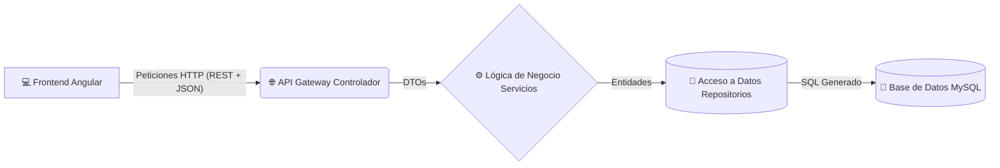
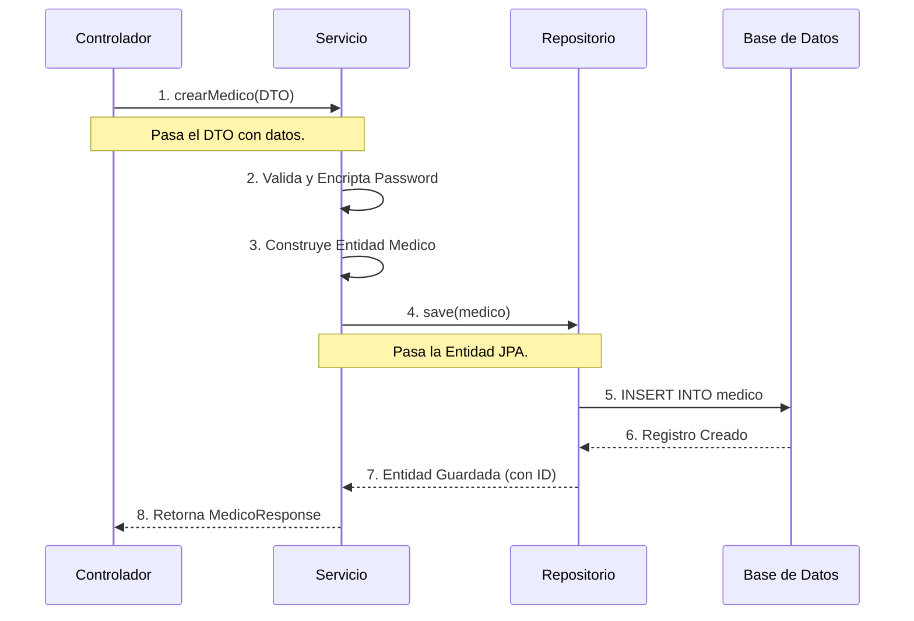

# 🚀 Guía Maestra del Backend - Clínica Aviva

¡Bienvenido a la guía de estudio definitiva para tu sustentación! Aquí no solo cubriremos lo que preguntaste inicialmente, sino **todos los conceptos clave de la arquitectura** que a los profesores de ingeniería de software y programación les encanta preguntar. 

> [!TIP]
> **Consejo para la exposición:** No te aprendas el código de memoria. Entiende *cómo fluye la información* desde que el usuario hace clic en el frontend hasta que se guarda en la base de datos.

---

## 🏛️ 1. Arquitectura General del Sistema

El proyecto sigue una arquitectura **Cliente-Servidor** separada, y dentro del backend utiliza una **Arquitectura de N-Capas (Layered Architecture)**, muy estándar en aplicaciones Spring Boot.

### ¿Cómo se comunican el Frontend, Backend y la BD?

1. **Frontend a Backend:** Se comunican a través de **Servicios RESTful**. El frontend (Angular) hace una petición `HTTP` (GET, POST, PUT, DELETE) hacia un *endpoint* del backend (ej. `http://localhost:8080/api/medicos`). Los datos viajan serializados en formato **JSON**.
2. **Seguridad (Frontend a Backend):** Para las rutas protegidas, Angular envía un **Token JWT (JSON Web Token)** en la cabecera `Authorization`. El backend (Spring Security) intercepta la petición, verifica que el token sea válido y extrae quién es el usuario y qué rol tiene (`ADMINISTRADOR`, `MEDICO`, `PACIENTE`).
3. **Backend a Base de Datos:** Se conectan mediante **JDBC** (Java Database Connectivity) usando el driver `mysql-connector-j`. Sin embargo, nosotros no escribimos JDBC puro; Spring Boot usa un **Pool de Conexiones (HikariCP)** para mantener múltiples conexiones abiertas y **Hibernate** traduce nuestro código Java a las sentencias SQL que MySQL entiende.

---

## 👨‍⚕️ 2. El Flujo de Creación (Ejemplo: Médico)

Para demostrar que sabes cómo está estructurado el código, usemos de ejemplo cómo se crea un médico en el sistema.

### Desglose de las Capas (Archivos)

*   **Capa Web (`MedicoController.java`):**
    *   Usa `@RestController` y `@RequestMapping("/api/medicos")`.
    *   Usa `@PreAuthorize("hasRole('ADMINISTRADOR')")` para asegurar que solo un Admin ejecute el código.
    *   Recibe el `MedicoRequest` usando `@RequestBody` y delega el trabajo al servicio.

*   **Capa de Negocio (`MedicoServiceImpl.java`):**
    *   Usa `@Service`. Es donde está el "cerebro" (reglas del negocio).
    *   Busca la `Especialidad` y al `Administrador` en la base de datos usando sus repositorios correspondientes.
    *   **¡Importante!** Usa `passwordEncoder.encode(...)` para no guardar contraseñas en texto plano.
    *   Transforma el objeto Java final usando el patrón `Builder` de Lombok.

*   **Capa de Acceso a Datos (`MedicoRepository.java`):**
    *   Usa `@Repository` y extiende de `JpaRepository<Medico, Integer>`.
    *   Al extender de esta clase, heredamos los métodos mágicos como `save()`, `findById()`, `findAll()` sin escribir el código internamente.

---

## 🥊 3. La Pregunta del Millón: ¿JPA o JDBC?

> [!CAUTION]
> **Si el profesor te pregunta:** *"Veo que no hay sentencias INSERT ni SELECT en su código, ¿Están usando JDBC directamente o algún ORM? ¿Cuál es la diferencia?"*

**Tu respuesta:** 
"Profesor, estamos utilizando **JPA (Java Persistence API)** mediante **Spring Data JPA**, el cual utiliza **Hibernate** como proveedor ORM (Object-Relational Mapping). No usamos JDBC puro."

| Característica | JDBC Puro | JPA (Hibernate) | ¿Por qué elegimos JPA? |
| :--- | :--- | :--- | :--- |
| **Manejo de SQL** | Manual. Escribes `SELECT * FROM...` en el código. | Automático. Mapeas tablas a objetos Java con `@Entity`. | **Ahorro de tiempo.** No reinventamos la rueda escribiendo SQL básico. |
| **Mantenimiento** | Alto. Si cambia una tabla, debes cambiar el texto de muchas consultas SQL. | Bajo. Cambias el nombre de la variable en la entidad de Java y listo. | **Menos errores.** El código es más limpio y fácil de mantener. |
| **Seguridad** | Riesgo de inyección SQL si no usas *PreparedStatement*. | Protegido por defecto. Hibernate escapa todos los parámetros automáticamente. | **Seguridad incorporada.** |
| **Rendimiento** | Ligeramente más rápido (si se optimiza a mano perfectamente). | Usa caché de primer nivel y carga perezosa (`FetchType.LAZY`). | Suficientemente rápido para la clínica, y el ahorro de código lo justifica. |

---

## 🎓 4. Más "Cosas de Examen" que te pueden preguntar

Para sacar la nota máxima, repasa estos 3 conceptos técnicos adicionales que implementa el proyecto:

### A. Patrón DTO (Data Transfer Object)
> [!NOTE]
> **Pregunta:** *"¿Por qué usan clases como `MedicoRequest` y `MedicoResponse` en lugar de enviar directamente la entidad `Medico` al frontend?"*
*   **Respuesta:** Por seguridad y diseño. Si enviamos la entidad `Medico` completa, estaríamos exponiendo datos sensibles (como la contraseña encriptada). Además, el frontend a menudo necesita datos formateados diferentes a los de la base de datos. Los DTO nos permiten enviar exactamente lo que necesita el cliente y nada más.

### B. Inyección de Dependencias (IoC - Inversion of Control)
> [!TIP]
> **Pregunta:** *"¿Cómo se instancian los servicios y repositorios en Spring Boot? ¿Veo que usan `final` pero nunca veo un `new MedicoServiceImpl()`?"*
*   **Respuesta:** Usamos el patrón de Inyección de Dependencias. Gracias a anotaciones como `@Service`, `@RestController` y la anotación `@RequiredArgsConstructor` (de Lombok), Spring Boot crea un único objeto (Singleton) de cada servicio/repositorio al arrancar el programa. Cuando un controlador necesita un servicio, Spring Boot "se lo inyecta" automáticamente a través del constructor. ¡Nosotros no usamos `new`!

### C. Manejo Global de Excepciones
> [!IMPORTANT]
> **Pregunta:** *"¿Qué pasa si ocurre un error en el backend? ¿El programa se cae?"*
*   **Respuesta:** No, hemos implementado un manejador de excepciones global (el archivo `GlobalExceptionHandler.java` que tiene `@ControllerAdvice` o `@RestControllerAdvice`). Si ocurre un error, por ejemplo, "Especialidad no encontrada", en lugar de que la aplicación se detenga o lance un error 500 feo en HTML, este interceptor atrapa el error y le devuelve al frontend un JSON limpio con el mensaje exacto y el código `404 Not Found` o `400 Bad Request`.

---

¡Con esta guía, tienes todas las armas necesarias para dominar la sustentación del backend! 🔥 Muestra seguridad al explicar que **Spring Boot** orquesta la seguridad, la inyección de dependencias y el acceso a datos.
